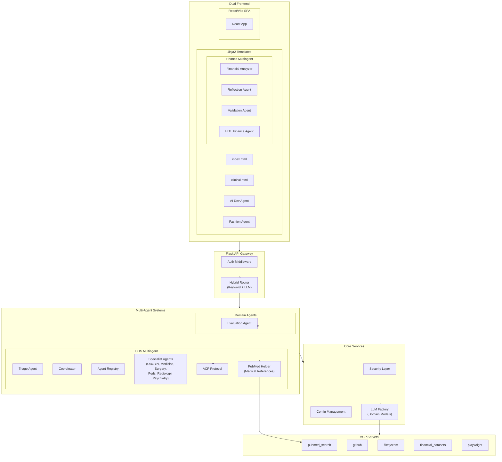
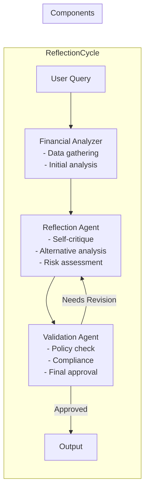
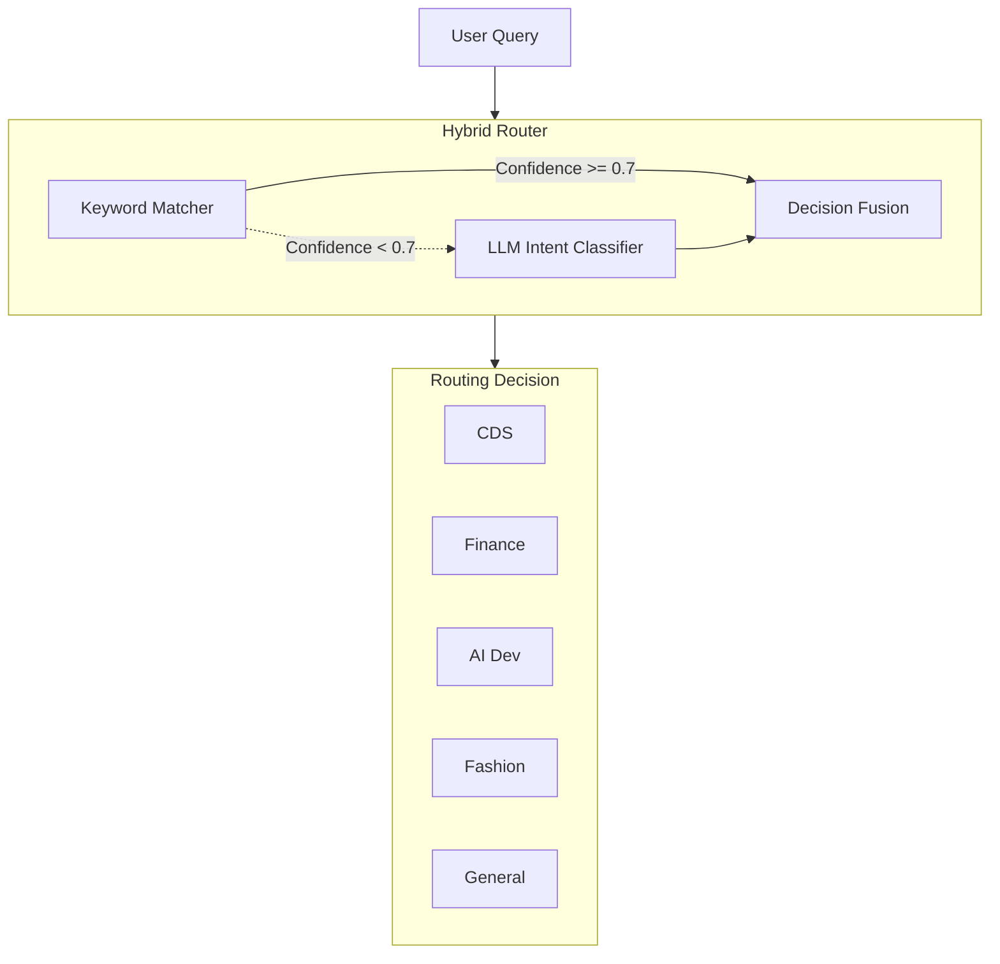

# Dr. Ikechukwu PA - Multi-Agent AI System Architecture

## Executive Summary

Transform the existing Flask-based Dr. Ikechukwu PA system into a sophisticated multi-agent AI platform with:

1. **CDS (Clinical Decision Support)** - Multiagentic system with 9 specialized medical agents using A2A (Agent-to-Agent) Protocol, plus PubMed medical references
2. **Finance Tool** - Reflection-based multiagent system with HITL (Human-In-The-Loop) validation
3. **Unified Routing** - Hybrid keyword + LLM-based intent classification
4. **Self-Improving Evaluation** - User feedback, accuracy metrics, response tracking
5. **Dual Frontend** - Jinja2 templates + React/Vite frontend with OAuth2 authentication
6. **Centralized LLM Factory** - Domain-specific model configuration with automatic fallback
7. **Conversation Memory** - Persistent storage for previous conversations

---

## 1. LLM Model Configuration

### 1.1 Domain-Specific Model Assignment

The system uses a centralized LLM factory with domain-specific model configurations and automatic fallback chains:

| Domain | Primary Model | Backup Model |
|--------|---------------|--------------|
| Clinical/Fashion | `openai/gpt-oss-120b:free` | `google/gemini-2.5-flash` |
| Coding/AI Dev | `stepfun/step-3.5-flash:free` | `arcee-ai/trinity-large-preview:free` |
| Finance | `google/gemini-2.5-flash` | `arcee-ai/trinity-large-preview:free` |

### 1.2 LLM Factory Architecture

```python
# src/core/llm_factory.py
class LLMFactory:
    """Centralized LLM factory with fallback chain"""
    
    DOMAIN_CONFIG = {
        "clinical": {
            "primary": "openai/gpt-oss-120b:free",
            "backup": "google/gemini-2.5-flash"
        },
        "fashion": {
            "primary": "openai/gpt-oss-120b:free",
            "backup": "google/gemini-2.5-flash"
        },
        "ai_dev": {
            "primary": "stepfun/step-3.5-flash:free",
            "backup": "arcee-ai/trinity-large-preview:free"
        },
        "finance": {
            "primary": "google/gemini-2.5-flash",
            "backup": "arcee-ai/trinity-large-preview:free"
        }
    }
    
    @classmethod
    def get_llm(cls, domain: str) -> LLM:
        """Get LLM instance for domain with fallback"""
        config = cls.DOMAIN_CONFIG.get(domain, cls.DOMAIN_CONFIG["clinical"])
        
        try:
            return load_llm(config["primary"])
        except Exception:
            return load_llm(config["backup"])
```

---

## 2. Multi-Agent Architecture Overview

### 2.1 System Components



---

## 3. API Routes

### 3.1 Route Overview

| Route | File | Description |
|-------|------|-------------|
| `/cds/*` | [`cds.py`](src/api/routes/cds.py) | Clinical Decision Support multi-agent system |
| `/finance/*` | [`finance.py`](src/api/routes/finance.py) | Financial analysis with reflection |
| `/ai/*` | [`ai_dev.py`](src/api/routes/ai_dev.py) | AI Development assistant |
| `/fashion/*` | [`fashion.py`](src/api/routes/fashion.py) | Fashion/Lifestyle planner |
| `/evaluation/*` | [`evaluation.py`](src/api/routes/evaluation.py) | Evaluation and metrics system |
| `/auth/*` | [`auth.py`](src/api/routes/auth.py) | OAuth2 authentication |

All route files use `LLMFactory` from [`config.py`](src/core/config.py) for domain-specific LLM configuration.

---

## 4. CDS Multi-Agent System (Clinical Decision Support)

### 4.1 Agent Specifications

| Agent | Specialty | Capability Boundary | Expertise Depth |
|-------|-----------|---------------------|-----------------|
| **Triage Agent** | Initial routing | Symptom assessment, urgency classification | High |
| **Coordinator** | Agent coordination | Task distribution, result aggregation | High |
| **Registry** | Agent discovery | Agent capabilities, availability | Medium |
| **PubMed Helper** | Medical references | PubMed search, PMID citations | High |
| **OB/GYN** | Obstetrics/Gynecology | Pregnancy, reproductive health, childbirth | Expert |
| **Medicine** | Internal Medicine | Cardiology, neurology, GI, respiratory | Expert |
| **Surgery** | General Surgery | Pre-op, post-op, surgical decision-making | Expert |
| **Pediatrics** | Pediatric Care | Neonatal, childhood diseases, growth | Expert |
| **Pathology** | Laboratory Medicine | Lab interpretation, biopsy, molecular diagnostics | Expert |
| **Pharmacology** | Clinical Pharmacy | Drug dosing, interactions, therapeutic monitoring | Expert |
| **Radiology** | Medical Imaging | X-ray, CT, MRI interpretation assistance | Expert |
| **Psychiatry** | Mental Health | Psychological assessment, treatment options | Expert |
| **Pathology** | Laboratory Medicine | Lab interpretation, biopsy, molecular diagnostics | Expert |
| **Pharmacology** | Clinical Pharmacy | Drug dosing, interactions, therapeutic monitoring | Expert |

### 4.2 CDS File Structure

```
src/agents/cds/
├── __init__.py              # Package initialization
├── acp_protocol.py          # Agent Communication Protocol
├── base_agent.py            # Base agent interface
├── coordinator.py           # Agent coordination logic
├── registry.py              # Agent discovery & registry
├── specialist_agents.py    # All specialist agent implementations
├── triage_agent.py          # Triage routing agent
└── pubmed_helper.py         # PubMed search for medical references
```

### 4.3 PubMed Medical References

The CDS system now includes medical reference lookup with PMID citations:

```python
# src/agents/cds/pubmed_helper.py
class PubMedHelper:
    """PubMed search helper for medical references"""
    
    def __init__(self, mcp_client):
        self.mcp_client = mcp_client
    
    async def search_medical_references(self, query: str, max_results: int = 5) -> list:
        """Search PubMed for medical references"""
        results = await self.mcp_client.call_tool(
            "pubmed_search",
            {"query": query, "max_results": max_results}
        )
        
        # Format with PMID citations
        formatted = []
        for result in results:
            formatted.append({
                "title": result["title"],
                "pmid": result["pmid"],
                "url": f"https://pubmed.ncbi.nlm.nih.gov/{result['pmid']}/",
                "abstract": result.get("abstract", "")
            })
        
        return formatted
```

### 4.4 ACP (Agent Context Protocol)

```python
# acp_protocol.py
class ACPMessage(TypedDict):
    message_id: str
    sender_id: str
    receiver_id: str
    message_type: str  # "request", "response", "handoff", "consult"
    context: dict
    payload: dict
    priority: str  # "low", "normal", "high", "urgent"
    timestamp: str
    trace_id: str
```

### 4.5 Advanced Skills System (State-of-the-Art)

The CDS now includes a comprehensive skills system inspired by top AI applications. Each specialist agent has a dedicated skill file with the **3-Phase Execution Protocol**:

```
src/agents/cds/skills/
├── __init__.py           # Skills loader and manager
├── obgyn_skill.md        # OB/GYN specialist skill
├── medicine_skill.md     # Internal medicine specialist skill
├── surgery_skill.md      # General surgery specialist skill
├── pediatrics_skill.md  # Pediatrics specialist skill
├── radiology_skill.md   # Radiology specialist skill
├── psychiatry_skill.md # Psychiatry specialist skill
├── pathology_skill.md  # Pathology specialist skill (NEW)
└── pharmacology_skill.md # Pharmacology specialist skill (NEW)
```

#### 3-Phase Execution Protocol (SOTA)

Every skill enforces a strict Chain-of-Thought (CoT) sequence:

| Phase | Objective | Description |
|-------|-----------|-------------|
| **Phase 1** | Direct Clinical Response | Answer user's question immediately in plain language |
| **Phase 2** | Advanced CDS Framework | Structured differentials, pathways, safety flags |
| **Phase 3** | Evidence Grounding | MCP tool calls for PubMed references |

#### Skills Features

| Feature | Description |
|---------|-------------|
| **Metadata** | JSON block with skill ID, version, guidelines, capabilities |
| **System Prompt** | Dynamic agent behavior definition |
| **Clinical Guidelines** | Evidence-based protocols with tables |
| **Reasoning Framework** | Clinical decision trees and algorithms |
| **Knowledge Base** | Disease protocols, dosing, classifications |
| **Safety Protocols** | Red flags, contraindications, emergency procedures |
| **PubMed Integration** | Automatic literature search patterns |
| **Quality Metrics** | Performance targets and measurement |
| **Version History** | Track updates and changes |

#### Skills Loader

```python
# Load skill for a specialty
from src.agents.cds.skills import skills_loader, get_system_prompt

# Get system prompt dynamically
obgyn_prompt = get_system_prompt("obgyn")

# Get safety protocols
safety = get_skill_safety_protocols("medicine")

# Get PubMed search patterns
searches = get_skill_pubmed_searches("surgery")
```

#### Skill Metadata Example

```json
{
  "skill_id": "cds.obgyn.v1",
  "name": "OB/GYN Specialist",
  "version": "1.0.0",
  "domain": "clinical",
  "specialty": "obstetrics_gynecology",
  "capabilities": ["prenatal_assessment", "high_risk_pregnancy", "reproductive_health"],
  "safety_level": "high",
  "requires_human_override": true,
  "guidelines": ["ACOG", "WHO", "SMFM"]
}
```

---

## 5. Finance Reflection Multi-Agent

### 5.1 Agent Architecture



### 5.2 Finance File Structure

```
src/agents/finance/
├── __init__.py                  # Package initialization
├── financial_analyzer.py        # Data gathering & initial analysis
├── reflection_agent.py          # Self-reflective agent
├── validator_agent.py           # Compliance validator
└── hitl_finance.py              # Human-In-The-Loop finance agent
```

---

## 6. MCP Server Infrastructure

### 6.1 Available MCP Servers

The system integrates with the following MCP servers:

| Server | Purpose | Tools |
|--------|---------|-------|
| `pubmed_search` | Medical literature search | `search`, `get_abstract` |
| `github` | GitHub repository operations | `list_repos`, `create_issue`, `search_code` |
| `filesystem` | File system operations | `read_file`, `write_file`, `list_directory` |
| `financial_datasets` | Financial data access | `get_stock_data`, `get_market_news` |
| `playwright` | Browser automation | `navigate`, `screenshot`, `click` |

### 6.2 MCP Client Implementation

```python
# src/agents/mcp_client.py
class MCPClient:
    """MCP client for external tool integration"""
    
    def __init__(self, server_configs: dict):
        self.servers = {}
        for name, config in server_configs.items():
            self.servers[name] = MCPClient.create_connection(config)
    
    async def call_tool(self, server_name: str, tool_name: str, params: dict):
        """Call a tool on an MCP server"""
        server = self.servers.get(server_name)
        if not server:
            raise ValueError(f"Unknown server: {server_name}")
        
        return await server.call_tool(tool_name, params)
```

---

## 7. Evaluation System

### 7.1 Metrics Collection

```
src/agents/evaluation/
├── __init__.py          # Package initialization
├── metrics.py           # Metrics collection
└── optimizer.py         # Improvement engine
```

### 7.2 Evaluation API Routes

| Endpoint | Method | Description |
|----------|--------|-------------|
| `/evaluation/feedback` | POST | Submit user feedback |
| `/evaluation/metrics` | GET | Get aggregated metrics |
| `/evaluation/interactions` | GET | List user interactions |

---

## 8. Hybrid Routing System

### 8.1 Keyword + LLM Routing



---

## 9. Frontend Architecture

### 9.1 Dual Frontend Strategy

The system supports two frontend options:

1. **Jinja2 Templates** - Server-side rendered HTML
2. **React/Vite SPA** - Modern single-page application

### 9.2 React/Vite Frontend

```
frontend/
├── package.json
├── vite.config.ts
├── index.html
├── src/
│   ├── main.tsx              # Entry point
│   ├── App.tsx               # Main app with routing
│   ├── App.css
│   ├── index.css
│   ├── components/
│   │   ├── BaseLayout.tsx
│   │   ├── ChatInterface.tsx
│   │   ├── RatingDialog.tsx
│   │   └── domains/
│   │       ├── AIDev.tsx
│   │       ├── Chart.tsx
│   │       ├── Fashion.tsx
│   │       └── Finance.tsx
│   ├── pages/
│   │   ├── AIDev.tsx
│   │   ├── Clinical.tsx
│   │   ├── Dashboard.tsx
│   │   ├── Fashion.tsx
│   │   └── Finance.tsx
│   ├── services/
│   │   └── api.ts            # API client with proper exports
│   ├── hooks/
│   └── apollo/
│       └── ApolloClient.ts
```

### 9.3 Frontend API Service

The frontend uses a centralized API service with proper exports:

```typescript
// frontend/src/services/api.ts
export const API_BASE_URL = import.meta.env.VITE_API_URL || 'http://localhost:5000';

export interface ClinicalQuery {
  query: string;
  patient_context?: object;
}

export interface FinanceQuery {
  query: string;
  risk_tolerance?: string;
}

export const api = {
  // Clinical Decision Support
  async clinicalQuery(data: ClinicalQuery) { ... },
  
  // Finance
  async financeQuery(data: FinanceQuery) { ... },
  
  // AI Development
  async aiDevQuery(code: string) { ... },
  
  // Fashion
  async fashionQuery(data: { style: string; occasion: string }) { ... },
  
  // Evaluation
  async submitFeedback(feedback: object) { ... },
};
```

---

## 10. Core Services

### 10.1 Core File Structure

```
src/core/
├── __init__.py              # Package initialization
├── config.py                # Configuration management (LLMFactory export)
├── llm_factory.py           # Centralized LLM factory with fallback chain
├── security.py              # Basic security utilities
└── security_layer.py        # Comprehensive security layer
```

### 10.2 Configuration

```python
# src/core/config.py
from .llm_factory import LLMFactory

# Export LLMFactory for use across the application
__all__ = ['LLMFactory']
```

---

## 11. OAuth2 Authentication

### 11.1 Auth Routes

| Endpoint | Method | Description |
|----------|--------|-------------|
| `/auth/login` | GET | Initiate OAuth login |
| `/auth/callback` | GET | OAuth callback handler |
| `/auth/logout` | GET | Logout user |
| `/auth/me` | GET | Get current user |

---

## 12. Project Structure Summary

```
dr_ikechukwu_pa/
├── ARCHITECTURE.md              # This file
├── README.md                     # Project documentation
├── requirements.txt              # Python dependencies
├── Dockerfile                    # Docker configuration
├── docker-compose.yml            # Docker Compose setup
├── frontend/                     # React/Vite frontend
│   ├── package.json
│   ├── vite.config.ts
│   ├── index.html
│   └── src/
│       ├── main.tsx
│       ├── App.tsx
│       ├── components/
│       ├── pages/
│       └── services/
│           └── api.ts            # API client
└── src/                          # Python backend
    ├── __init__.py
    ├── api/
    │   ├── main.py               # Flask app entry point
    │   ├── routes/               # API route handlers
    │   │   ├── cds.py
    │   │   ├── finance.py
    │   │   ├── ai_dev.py
    │   │   ├── fashion.py
    │   │   ├── evaluation.py
    │   │   ├── auth.py
    │   │   └── semantic_routing.py
    │   ├── templates/            # Jinja2 templates
    │   └── static/              # Static assets
    ├── agents/
    │   ├── cds/                 # Clinical Decision Support
    │   │   ├── acp_protocol.py
    │   │   ├── base_agent.py
    │   │   ├── coordinator.py
    │   │   ├── registry.py
    │   │   ├── specialist_agents.py
    │   │   ├── triage_agent.py
    │   │   └── pubmed_helper.py
    │   ├── finance/             # Finance agents
    │   │   ├── financial_analyzer.py
    │   │   ├── reflection_agent.py
    │   │   └── validator_agent.py
    │   ├── evaluation/          # Evaluation system
    │   │   ├── metrics.py
    │   │   └── optimizer.py
    │   ├── mcp_client.py        # MCP client
    │   └── supervisor.py        # Agent supervisor
    └── core/                    # Core services
        ├── config.py            # Configuration
        ├── llm_factory.py       # LLM factory
        ├── security.py          # Security utilities
        └── security_layer.py    # Security layer
```

---

## 13. Key Features Summary

1. **Domain-Specific LLM Configuration**: Each domain (Clinical, Fashion, AI Dev, Finance) uses specialized models with automatic fallback
2. **Medical References**: PubMed integration with PMID citations for clinical queries
3. **MCP Integration**: External tool servers for enhanced capabilities
4. **HITL Finance**: Human-in-the-loop validation for financial decisions
5. **Dual Frontend**: Both Jinja2 templates and React/Vite SPA options
6. **OAuth2 Authentication**: Secure authentication with Google/GitHub
7. **Self-Improving**: Evaluation system with metrics collection and optimization
